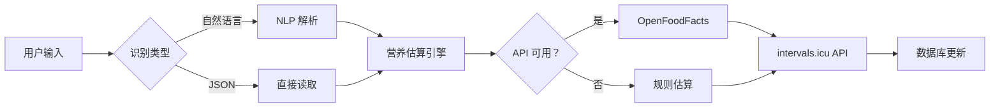

# 🏋️ Fitness Personal Assistant

一体化健身追踪系统，帮你管理饮食记录和身体状态，自动同步到 [intervals.icu](https://intervals.icu)。


---

## 🚀 快速开始

### 环境要求

- ✅ macOS / Linux
- ✅ Bash 4.0+
- ✅ `jq` 命令行工具
- ✅ `curl` 网络请求工具
- ✅ `perl` (用于文本处理)

### 安装步骤

```bash
# 1. 克隆技能目录
cd ~/.openclaw/workspace/skills

# 2. 配置你的 intervals.icu 凭证
mkdir -p ~/.openclaw/workspace/body-management-data
cp fitness-personal-assistant/config.example.json ~/.openclaw/workspace/body-management-data/config.json
# 编辑 config.json，填入你的 API Key 和 Athlete ID
nano ~/.openclaw/workspace/body-management-data/config.json

# 3. 验证安装
./fitness-personal-assistant/scripts/meal-to-intervals.sh --health-check
```

---

## 🎯 核心功能

### 🍽️ 智能饮食记录

用自然语言记录餐食，系统自动计算营养并同步到 intervals.icu:

```bash
# 最简单的用法
./meal-to-intervals.sh --text "早餐两个鸡蛋一片全麦面包"

# 混合多种食物
./meal-to-intervals.sh --text "午餐鸡胸肉 200g 配西兰花"

# 自定义存储路径
./meal-to-intervals.sh -s /custom/path --text "晚餐一碗米饭"
```

**支持的食物识别:**
- 肉类：牛肉、鸡胸肉、鱼、虾等
- 主食：米饭、面条、面包、馒头等
- 蔬果：各种蔬菜水果
- 乳制品：牛奶、酸奶、奶酪
- 油脂类：食用油、黄油

### 💪 身体状态查询

查看你的训练负荷和恢复情况:

```bash
./intervals-status-reporter.sh

# 输出示例
┌─────────────────💪 身体状态报告 - 2026-03-10 ───────────────────┐
│ 生成时间：10:30                                                  │
└──────────────────────────────────────────────────────────────────┘

📊 训练负荷
形态评分：🟡 良好 (3.5)
体能 (CTL 类似): 20 小时   🐢 长期训练状态
疲劳 (ATL 类似):  15 小时   🐇 当前疲劳水平
TSB (平衡):      5.0        🎯 恢复与负荷平衡

💤 恢复指标
HRV (心率变异性): 45.0 ms  💓 自主神经系统平衡
静息心率：58 bpm  ❤️ 越低越好
睡眠时长：7.5 小时 (450 分钟)

🎯 训练建议
🙂 恢复良好 - 保持当前训练量💪
```

---

## 🔧 高级用法

### JSON 格式输入

创建 `meal.json`:

```json
{
  "meal_name": "午餐",
  "meal_time": "2026-03-10T12:30:00+08:00",
  "items": [
    {"name": "鸡胸肉", "grams": 200},
    {"name": "西兰花", "grams": 150}
  ]
}
```

执行：

```bash
./meal-to-intervals.sh --input meal.json
```

### 干跑模式（测试）

不上传数据，只计算营养：

```bash
./meal-to-intervals.sh --dry-run --text "300g 牛肉"
```

### 环境变量方式

```bash
BODY_MANAGEMENT_DATA=/custom/data/path ./meal-to-intervals.sh --text "早餐"
```

---

## 🛠️ 技术细节

### 架构设计



### 依赖清单

| 依赖 | 用途 | 来源 |
|------|------|------|
| `bash` | 脚本运行环境 | 系统自带 |
| `jq` | JSON 处理 | [jq GitHub](https://github.com/jqlang/jq) |
| `curl` | HTTP 请求 | 系统自带 |
| `perl` | 文本正则匹配 | 系统自带 |

### 外部 API

- **OpenFoodFacts**: [world.openfoodfacts.org/api](https://world.openfoodfacts.org/api-factsearch-en)
- **Intervals.icu**: [api.intervals.icu](https://intervals.icu/api-docs)

---

## 📊 使用场景

### 减脂期饮食追踪

```bash
# 早餐：控制热量
./meal-to-intervals.sh --text "早餐一个水煮蛋一杯黑咖啡"

# 午餐：高蛋白低碳水
./meal-to-intervals.sh --text "午餐鸡胸肉 200g 配大量蔬菜"

# 晚餐：轻食为主
./meal-to-intervals.sh --text "晚餐一份烤鱼肉 150g"
```

### 增肌期营养规划

```bash
# 训练后补充
./meal-to-intervals.sh --text "增肌粉一勺鸡胸肉 200g 米饭 150g"
```

### 恢复日监测

```bash
# 每天早晚查询身体状态
./intervals-status-reporter.sh
```

---

## ⚠️ 注意事项

1. **数据隐私**: 所有健康数据存储在 intervals.icu 云端，本地仅保存配置文件
2. **API 限流**: OpenFoodFacts 有速率限制，重复请求会退避重试
3. **中文支持**: 内置中→英映射表，但部分中国特色食材可能需要手动补充
4. **错误降级**: API 失败时自动切换到规则估算，确保可用性

---

## 🔄 版本历史

详见 [`CHANGELOG.md`](./CHANGELOG.md) 或 [`SKILL.md`](./SKILL.md)

---

## 📄 License

MIT License - 详见 [`LICENSE`](./LICENSE)

---

## 🙏 Credits

- 概念灵感：[Peloton Analytics - TSS/ATS](https://peaktactics.com/blog/training-stress-scores-explained/)
- 数据源：[OpenFoodFacts Community](https://world.openfoodfacts.org/)
- 平台：[intervals.icu](https://intervals.icu)

---

**Made with ❤️ by OpenClaw Community**
